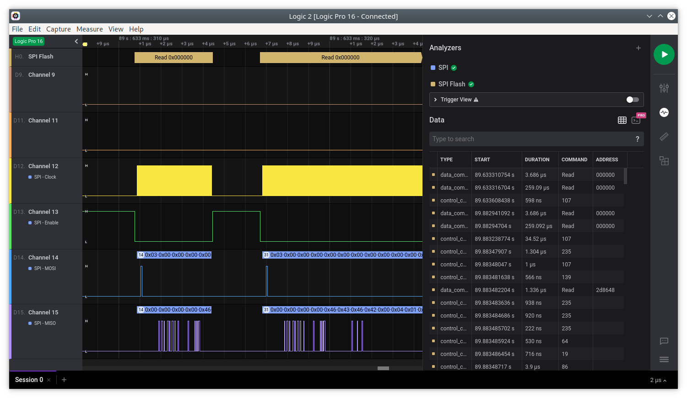

# SPI Flash Analyzer for Logic 2

This is a basic high level analyzer for Saleae Logic 2 that interprets semi-standard SPI flash commands. The output can be limited by command type and data commands can also be limited by address. One can add the analyzer multiple times to get separate analysis tracks for different types of commands.

## Installation

In Logic 2, click extensions on the right hand side.

### To Use

Under the three dot, more menu, click `Check for Updates` then install the `SPI Flash` extension.

### To Develop

1. Clone this repo locally.
2. Under the three dot, more menu, click `Load Existing Extension...` and then select the local repo location.

## Usage
1. Click the analyzers tab.
2. Add a `SPI` analyzer and configure it for your capture.
3. Add a `SPI Flash` analyzer.
4. Set the `SPI` analyzer as the Input Analyzer.
5. `Min Address`, `Max Address` and `Decode Level` are optional.
6. Change `Address Bytes` to match 